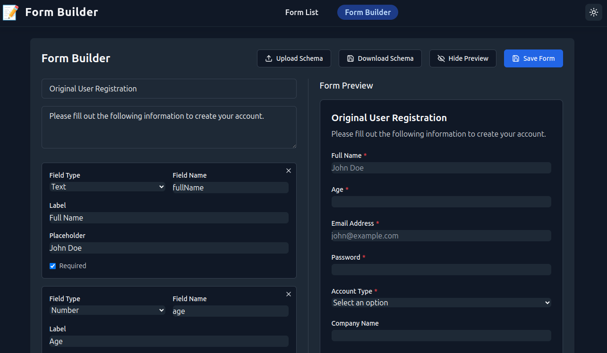

# Form Builder



## 📝 Introduction

Welcome to **Form Builder** — a modern, open-source tool for designing, building, and managing custom forms with ease! Whether you're a developer, designer, or business owner, Form Builder empowers you to create beautiful, dynamic forms for surveys, registrations, feedback, and more. Try it out and streamline your data collection process today!

---

## 🚀 Getting Started

### Prerequisites

- [Node.js](https://nodejs.org/) (v18 or higher recommended)
- [npm](https://www.npmjs.com/) (comes with Node.js)

### Installation

1. **Clone the repository:**
   ```bash
   git clone https://github.com/your-username/form_builder.git
   cd form_builder
   ```

2. **Install dependencies:**
   ```bash
   npm install
   cd server
   npm install
   cd ..
   ```

3. **Run the application (client + server):**
   ```bash
   npm run dev
   ```
   This will start both the frontend (React) and backend (Node.js/Express) servers concurrently.

4. **Open your browser:**
   - Visit [http://localhost:5173](http://localhost:5173) to use the Form Builder.

---

## ✨ What Does Form Builder Do?

- **Customizable Fields:** Add, remove, and configure various field types (text, dropdown, checkbox, etc.).
- **Live Preview:** Instantly see how your form looks and behaves as you build it.
- **Persistence:** Save and load forms; responses are stored in a local SQLite database.
- **Modern UI:** Built with Tailwind CSS for a sleek, responsive experience.
- **Extensible:** Easily add new field types or validation rules.

> **Note:** Drag-and-drop functionality is not currently implemented, but the application provides an intuitive interface for form creation and management.

---

## 🛠️ Tech Stack & How It Works

### Frontend

- **React 18**: Modern, component-based UI.
- **TypeScript**: Type safety for robust development.
- **Vite**: Fast development/build tool.
- **Tailwind CSS**: Utility-first CSS framework for rapid UI development.
- **React Router v7**: Client-side routing.
- **Lucide React & React Icons**: Iconography.
- **React Hot Toast**: User notifications.

### Backend

- **Node.js + Express**: REST API for form and response management.
- **SQLite**: Lightweight, embedded database for storing forms and submissions.
- **TypeScript**: Type-safe backend logic.

### How It Works

- The frontend provides a user-friendly UI for building forms, which are saved to the backend via REST API calls.
- Users can create, edit, and preview forms in real-time.
- Submitted form data is stored in a local SQLite database.
- The application is fully type-safe, leveraging TypeScript across both client and server.
- Development is streamlined with Vite and hot reloading for rapid iteration.

---

## 🤝 Contributing

We welcome contributions! Please open issues or submit pull requests for new features, bug fixes, or improvements.

---

## 📄 License

This project is licensed under the MIT License.